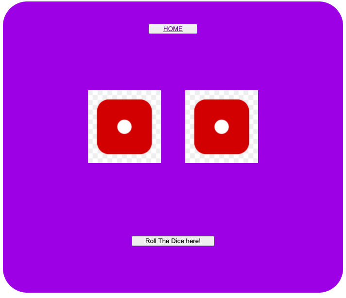
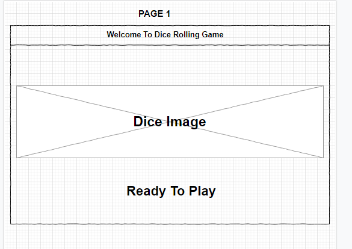
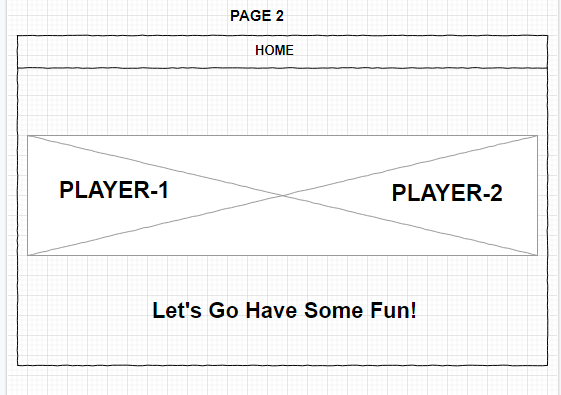
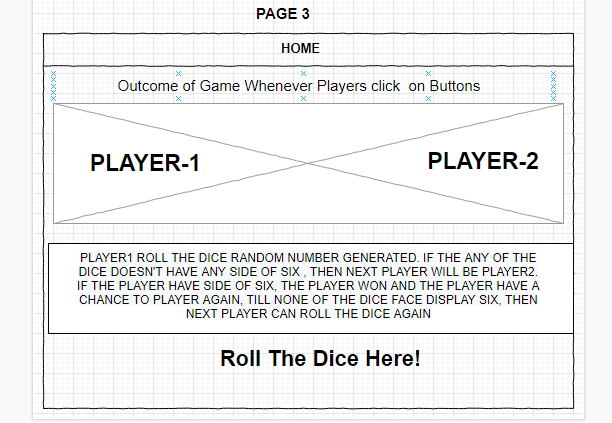

# Project Title

## DICE ROLLING GAME

* Dice rolling game is a game made with square shape that has six sides.

### Motivation

* I love playing this game, this game was my childhood game, i learn how to play the game from my mother, and thats one of what i love to do at my free time and its always fun for me.
---
### Screenshots
screen captures of your app

---
### User Stories 

* This game consist of three pages linked together
* First page is a welcome page linked to second page
* Second page consists of players icons or emoji that represent the players. "let's go have some fun" button linked it to page3
* Third page is where to play the game
* Each die display represents each player
* if player-1 roll the dice and none of the side display six,
* next player will be player-2 but if one of the sides or both sides display 
* six, the current player won and the current have a chance to play again 
* until the current player have no six and the next player can roll the dice

### Wireframes

---
## Technologies 
* Html
* CSS
* Javascript

###  Code Snippets
* const start= document.querySelector(".start")
start.addEventListener("click", ()=>{
    const randomDiceDisplay1 = Math.floor(Math.random()*6)+1
    const randomDiceDisplay2 = Math.floor(Math.random()*6)+1

    const diceRoll1 = "imageOfSixDice/Dice-" + randomDiceDisplay1 + ".png"
    const diceRoll2 = "imageOfSixDice/Dice-" + randomDiceDisplay2+ ".png"
    document.querySelector(".dicep1").setAttribute('src', diceRoll1)
    console.log(dicep1)
    document.querySelector(".dicep2").setAttribute('src', diceRoll2) 
    console.log(dicep2)

    diceFunc(randomDiceDisplay1, randomDiceDisplay2)
})

function diceFunc(param1, param2){
    if(param1 === 6){
        document.querySelector("p").innerText ="Player1 won, you can roll again"
    } else if(param2 === 6){
        document.querySelector("p").innerText ="Player2 won, you can roll again"
    }else{
        document.querySelector("p").innerText ="Next player, current player wait for your turn"
    }
}

---
# Credits

### General Assembly instructors for sei-111
* James Sinkler
* Anna Zocher
* Brian Krabec
* Nick Schmitt

---

### Future development

* I will to work more on writting different logic that does same function such using array 
* An array that holds the numbers 1 - 6
A function that uses Math.random() to return a random number in that range
Conditionals for what should happen based on the random number that is returned and displaying in your div with DOM manipulation! :slightly_smiling_face:
(edited)